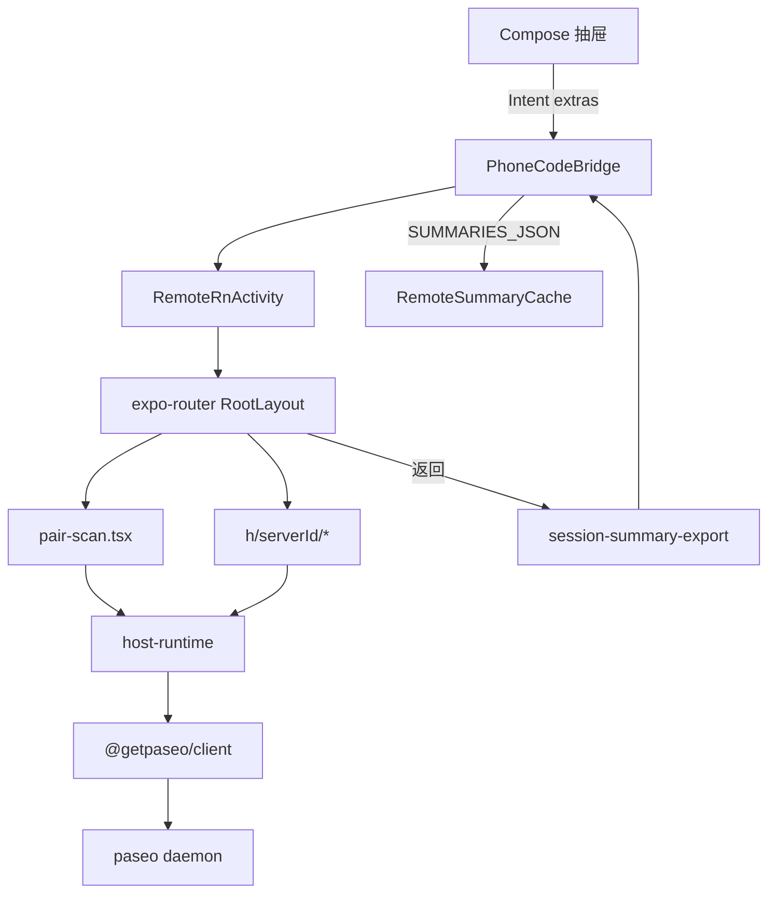

# PhoneCode × paseo：全量挂载 remote-ui 设计

日期：2026-07-15  
状态：已评审（对话确认 §1–§3）  
前置：`2026-07-14-paseo-remote-rn-design.md`（壳 + Bridge + 路径 S/S2）  
本设计取代「轻量 embedded 配对闭环 / 不挂 expo-router」增量方案。

## 1. 目标

在 PhoneCode 单一 APK 中，**直接复用** `@phonecode/remote-ui`（同步自 paseo 的 `packages/app` 等）完整 RN 业务树：

- 配对（`pair-scan` + `connectToDaemon`）
- 主机 / 会话路由（`/h/{serverId}/…`）
- 远程 agent 聊天
- 返回 Compose 时经 Bridge 回写远程摘要

Compose 壳、本地 agent、路径 S/S2 工具链不变。

## 2. 已确认决策

| 项 | 选择 |
|----|------|
| 产品范围 | 完整远程功能（非仅探测连接） |
| UI/连接实现 | **直接复用** paseo remote-ui 目标代码 |
| 路由 / 运行时 / 样式 | **挂载** expo-router、host-runtime、unistyles、i18n |
| 平行 embedded 扫码页 | 不再作为默认产品路径；可删或仅 fallback |
| Bridge | 已有契约保持：`getLaunchExtras` + `finishWithSummaries` |
| 持久化 | host-runtime 权威；Compose `RemoteSummaryCache` 只缓存列表摘要 |
| 私有依赖 | path / sync：`@getpaseo/expo-two-way-audio` 等；缺则 stub 非关键路径 |
| Feature flag | `phonecode.remoteRn` 控制是否进入 RN |

## 3. 非目标（本阶段）

- 主题/导航与 Compose 深度视觉对齐
- 远程 git / 全量设置页打磨
- 语音输入必须可用（可 JS/原生 stub，不挡文字聊天）
- 再维护一套与 paseo 分叉的 embedded 配对业务实现

## 4. 总体架构

**原则**

1. 业务语义以 paseo app 为准；PhoneCode 只做壳与 Intent/Result 桥。
2. 不平行实现 `connectToDaemon` / 配对 UI，避免与目标代码偏差。
3. 依赖闭包一次对齐；用 `assembleDebug` 与真机配对作为门禁。

## 5. 组件边界

| 单元 | 职责 |
|------|------|
| Compose / `RnBridge` / `SessionFacade` | 打开 pair/host/chat；收摘要刷新抽屉 |
| `PhoneCodeBridge` | extras 注入；`finishWithSummaries(json)` |
| JS 根入口 | expo-router 指向 `packages/remote-ui/app` 的 `src/app` |
| Boot | 读 extras → `hrefFromEmbeddedExtras` → `router.replace` |
| 业务页面 | 原样使用 `pair-scan`、host、agent 路由 |
| `session-summary-export` | Activity 结束前从 host-runtime 导出摘要 |
| `RemoteSummaryCache` | 持久化摘要 JSON，供冷启动抽屉展示 |

## 6. 依赖闭包与接线

| 层 | 做法 |
|----|------|
| npm | 根工程 workspaces / `file:` 挂 `packages/remote-ui/{app,client,protocol,relay,highlight}`；提升 app 运行时依赖到根 |
| 私有模块 | `@getpaseo/expo-two-way-audio`：`file:` 指上游或扩 `sync-remote-ui.sh` 同步；autolink |
| Metro | `watchFolders` + `extraNodeModules` 映射 `@getpaseo/*`；`@/` → `packages/remote-ui/app/src` |
| 入口 | `index.js` 改为 expo-router entry；废弃平行 `App.tsx` 业务树为默认根 |
| 版本 | 钉 S2：RN 0.81.5 / Expo 54；reanimated/worklets 以根已验证版本为准 |
| Gradle | 路径 S 不变；新 Expo 模块 autolinking；非关键原生可后置 stub |

**风险对策**

- 依赖爆炸：一次安装，按模块修 shim，门禁 `assembleDebug`
- 桌面/Web 分支：native 上应跳过；误 import 用 platform stub
- 双入口：过渡期可不删 embedded 文件，但默认根必须是全量 app 树

## 7. Intent / Result 契约（沿用）

### Compose → RN

| Extra | 含义 |
|-------|------|
| `ROUTE` | `pair` \| `host` \| `chat` |
| `HOST_ID` | serverId |
| `AGENT_ID` | agentId |
| `EMBEDDED` | 恒为 true（PhoneCode 嵌入） |

路由映射见 `hrefFromEmbeddedExtras`：

- `pair` → `/pair-scan?source=phonecode`
- `host` → `/h/{hostId}/sessions`
- `chat` → `/h/{hostId}/agent/{agentId}`

### RN → Compose

`SUMMARIES_JSON`：`hosts[]`（`hostId`、`hostLabel`、`connectionState`、`sessions[]`）。

- 无会话时仍可回写主机行（`sessions=[]`）
- 配对成功进入主机后**不强制**立刻关 Activity；用户返回时再导出

## 8. 错误处理

| 场景 | 行为 |
|------|------|
| 扫码/连接失败 | paseo `pair-scan` Alert；不关 Activity |
| 模块缺失 | 启动期可读错误；语音等非关键路径 stub |
| RN 崩溃 | Compose 本地仍可用；摘要保留上次成功值 |
| 断网 | host-runtime Disconnected；抽屉同步 |

## 9. 验收标准

1. 抽屉「连接远程」→ 真 `pair-scan` → `connectToDaemon` 成功进入主机相关页
2. 可打开远程 agent 并发送文字消息（语音可 stub）
3. 返回 Compose：远程分区出现摘要；杀进程后摘要仍在，可再进 RN
4. `:app:assembleDebug` 通过
5. `phonecode.remoteRn=false` 时行为与整合前一致

## 10. 回滚

- Flag 关闭远程入口
- 入口/依赖大改以整 commit 回退
- 不把「半套 embedded 默认根」保留为并行产品路径

## 11. 与旧方案关系

| 旧方案（已否决为本阶段主路径） | 本设计 |
|------------------------------|--------|
| 扩展 `EmbeddedPairScanScreen` + 精简 connect | 挂全量 expo-router / host-runtime |
| 不挂 unistyles/i18n | 一并挂载，与目标代码一致 |
| 先 A 再 B/C 增量 | 直接冲完整远程功能，用依赖 shim 消化风险 |

`2026-07-14` 设计中的壳、Facade、Bridge、路径 S/S2 **仍然有效**；本文件仅替换「远程 UI 如何挂载」的实现策略。
